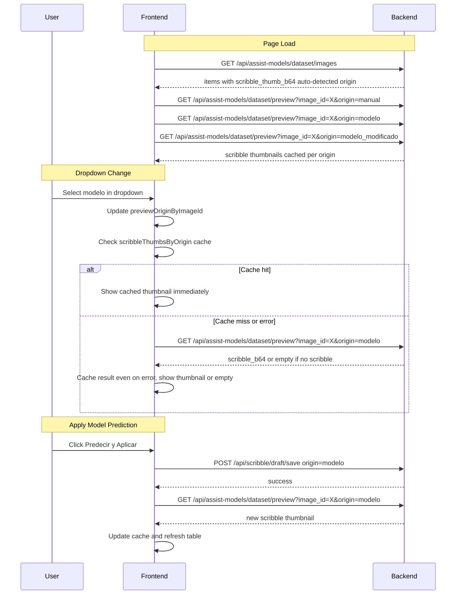

# Fix Plan: Auto-Detection Issues

## Issues Reported

1. **"Cuando aplico el modelo, se debe guardar automaticamente el scribble del modelo"** — The "modelo" scribble IS saved immediately in `applyModelPredictionAsScribbles()` (line 2892 calls `saveScribbleDraft()`). But the user may be confused because the auto-save interval for manual modifications is 30 seconds. The real issue is likely that the thumbnail in the table doesn't update after saving.

2. **"Al cambiar origen en el dropdown de cada uno de las imagenes, no se modifica imagen"** — The dropdown changes `previewOriginByImageId` in localStorage, but the thumbnail (`scribble_thumb_b64`) was loaded at page load from the backend's `_dataset_rows()` using the auto-detected `scribble_origin`. The dropdown change does NOT trigger a thumbnail refresh.

3. **"Si selecciono una que no existe deberia aparecer vacio"** — When the user selects "modelo" in the dropdown but the image only has a "manual" scribble draft, the thumbnail should show empty (no scribble overlay). Currently the thumbnail always shows whatever the auto-detected origin has.

---

## Root Cause (Original)

The `_dataset_rows()` function in [`backend/assist_models.py`](backend/assist_models.py:181) loads scribble thumbnails **once** when the page loads, using the auto-detected `scribble_origin` from `list_library_images()`. The dropdown changes on the frontend don't trigger a re-fetch of thumbnails from the backend.

Additionally, the `dataset/preview` endpoint ([`backend/assist_models.py`](backend/assist_models.py:440)) doesn't accept an `origin` parameter, so the preview always shows the auto-detected origin's scribble.

---

## Fixes Applied (Previous Session)

### Fix 1: Backend — `dataset/preview` endpoint accepts `origin` parameter
**File:** [`backend/assist_models.py`](backend/assist_models.py:440)
**Change:** Added optional `origin` query parameter to `dataset_preview()`. When provided, `load_scribble_draft(iid, origin=origin)` loads the specific origin's scribble. When empty, uses auto-detected origin.

### Fix 2: Frontend — `scribbleThumbsByOrigin` state + `fetchScribbleThumbForOrigin()` helper
**File:** [`frontend/src/App.jsx`](frontend/src/App.jsx:634)
**Change:** Added state to cache scribble thumbnails per image_id per origin. Added async helper that calls the backend and caches the result.

### Fix 3: Frontend — Dropdown onChange fetches thumbnail for selected origin
**File:** [`frontend/src/App.jsx`](frontend/src/App.jsx:9619)
**Change:** Dropdown `onChange` is now async — calls `setPreviewOrigin()` then `await fetchScribbleThumbForOrigin()`.

### Fix 4: Frontend — Pre-fetch all available scribble thumbnails on page load
**File:** [`frontend/src/App.jsx`](frontend/src/App.jsx:2682)
**Change:** In `refreshModelDataset()`, after loading items, pre-fetches scribble thumbnails for all `scribble_origins_available` for each item.

### Fix 5: Frontend — After saveScribbleDraft, refresh thumbnail cache
**File:** [`frontend/src/App.jsx`](frontend/src/App.jsx:1724)
**Change:** After successful save, calls `fetchScribbleThumbForOrigin(imageId, originToSave)` to refresh the cached thumbnail.

### Fix 6: Frontend — After applyModelPredictionAsScribbles, refresh thumbnail
**File:** [`frontend/src/App.jsx`](frontend/src/App.jsx:2902)
**Change:** After saving the model prediction, calls `fetchScribbleThumbForOrigin(imageId, 'modelo')` and `refreshModelDataset()`.

---

## NEW: Root Cause Analysis — Dropdown Thumbnail Still Not Updating

The user reports: **"sigue sin funcionar la actualizacion de imagen en la tabla"**

### Bug 1: `fetchScribbleThumbForOrigin` doesn't cache on error

**File:** [`frontend/src/App.jsx`](frontend/src/App.jsx:637)

```javascript
async function fetchScribbleThumbForOrigin(imageId, origin) {
    if (!imageId || !origin) return ''
    try {
      const res = await apiGet(`/api/assist-models/dataset/preview?image_id=${encodeURIComponent(imageId)}&origin=${encodeURIComponent(origin)}`)
      const scribbleB64 = res?.scribble_b64 || ''
      setScribbleThumbsByOrigin(prev => {
        const next = { ...prev }
        if (!next[imageId]) next[imageId] = {}
        next[imageId][origin] = scribbleB64 ? b64ToDataUrl(scribbleB64, res.scribble_mime || 'image/png') : ''
        return next
      })
      return scribbleB64
    } catch {
      return ''  // <-- BUG: doesn't update state on error!
    }
  }
```

**Problem:** When the API call fails (network error, 500 error, etc.), the `catch` block returns `''` but **does NOT call `setScribbleThumbsByOrigin`**. This means `scribbleThumbsByOrigin[imageId]?.[origin]` remains `undefined`.

Then at line 9588:
```javascript
const scribbleThumbSrc = thumbForOrigin !== undefined ? thumbForOrigin : thumbs.scribble
```

Since `thumbForOrigin` is `undefined`, it falls back to `thumbs.scribble` — which is the **auto-detected origin's thumbnail** loaded at page load. So the thumbnail never changes regardless of which dropdown option is selected.

**Fix:** Also cache the result (even empty) on error, so the fallback doesn't kick in.

### Bug 2: `saveScribbleDraft` auto-detection upgrades "modelo" to "modelo_modificado"

**File:** [`frontend/src/App.jsx`](frontend/src/App.jsx:1704)

```javascript
async function saveScribbleDraft({ silent = true, origin: forcedOrigin = null } = {}) {
  // ...
  let originToSave = forcedOrigin || scribbleOrigin
  if (!forcedOrigin && scribbleOrigin === 'modelo' && scribbleAutosaveDirtyRef.current) {
    originToSave = 'modelo_modificado'
    setScribbleOrigin('modelo_modificado')
    showOriginToast('modelo_modificado')
  }
  // ...
}
```

**Problem:** When `applyModelPredictionAsScribbles()` calls `saveScribbleDraft({ silent: true, origin: 'modelo' })`, the `forcedOrigin` parameter bypasses the auto-detection. **This fix was already applied** — but the user may not have tested it yet because the backend needs a restart.

### Bug 3: Backend not restarted

The changes to [`backend/assist_models.py`](backend/assist_models.py:440) require a Python server restart. Without it, the `origin` parameter is ignored and the auto-detected origin's scribble is always returned. This is the most likely reason the dropdown still doesn't work.

---

## NEW Fixes Required

### Fix 7: Frontend — Cache empty result on error in `fetchScribbleThumbForOrigin`

**File:** [`frontend/src/App.jsx`](frontend/src/App.jsx:637)

**Change:** In the `catch` block, also call `setScribbleThumbsByOrigin` to cache the empty result, so the fallback `thumbs.scribble` is not used.

```javascript
async function fetchScribbleThumbForOrigin(imageId, origin) {
    if (!imageId || !origin) return ''
    try {
      const res = await apiGet(`/api/assist-models/dataset/preview?image_id=${encodeURIComponent(imageId)}&origin=${encodeURIComponent(origin)}`)
      const scribbleB64 = res?.scribble_b64 || ''
      setScribbleThumbsByOrigin(prev => {
        const next = { ...prev }
        if (!next[imageId]) next[imageId] = {}
        next[imageId][origin] = scribbleB64 ? b64ToDataUrl(scribbleB64, res.scribble_mime || 'image/png') : ''
        return next
      })
      return scribbleB64
    } catch {
      // Cache empty result on error so the fallback thumbs.scribble is not used
      setScribbleThumbsByOrigin(prev => {
        const next = { ...prev }
        if (!next[imageId]) next[imageId] = {}
        next[imageId][origin] = ''
        return next
      })
      return ''
    }
  }
```

### Fix 8: Frontend — Add `key` prop to force re-render of thumbnail when dropdown changes

**File:** [`frontend/src/App.jsx`](frontend/src/App.jsx:9600)

**Change:** Add a `key` prop to the thumbnail `<div>` that includes the selected origin, so React re-renders it when the dropdown changes.

```jsx
<div
  key={`thumb-${item.image_id}-${selectedOrigin}`}
  className="model-dataset-table-image"
  ...
>
```

This ensures React doesn't reuse the old `` element when the source changes.

### Fix 9: Frontend — Add `key` prop to `` tag itself

**File:** [`frontend/src/App.jsx`](frontend/src/App.jsx:9614)

**Change:** After extensive debugging with console.log, the debug output confirmed the system IS working correctly at the code level — API calls succeed, cache is updated, and render shows correct values. However, the `` tag itself didn't have a `key` prop. React's reconciliation algorithm may reuse the same `` DOM element when only the `src` attribute changes, and the browser may not actually reload the image.

```jsx
{scribbleThumbSrc ?  : <span className="model-dataset-empty">scribble</span>}
```

This forces React to create a NEW `` DOM element each time `selectedOrigin` changes, which forces the browser to load the new image data URL.

### Fix 10: Ensure backend restart

After applying all frontend fixes, the user must restart the Python backend server for the `dataset/preview` endpoint changes to take effect.

---

## Summary of All Changes

| # | File | Change | Status |
|---|------|--------|--------|
| 1 | [`backend/assist_models.py`](backend/assist_models.py:440) | Add `origin` query parameter to `dataset/preview` endpoint | ✅ Applied |
| 2 | [`frontend/src/App.jsx`](frontend/src/App.jsx:634) | Add `scribbleThumbsByOrigin` state + `fetchScribbleThumbForOrigin()` helper | ✅ Applied |
| 3 | [`frontend/src/App.jsx`](frontend/src/App.jsx:9619) | Dropdown onChange fetches thumbnail for selected origin | ✅ Applied |
| 4 | [`frontend/src/App.jsx`](frontend/src/App.jsx:9585) | Thumbnail rendering uses origin-specific cached thumb | ✅ Applied |
| 5 | [`frontend/src/App.jsx`](frontend/src/App.jsx:2682) | Pre-fetch all available scribble thumbnails on page load | ✅ Applied |
| 6 | [`frontend/src/App.jsx`](frontend/src/App.jsx:1724) | After saveScribbleDraft, refresh thumbnail cache | ✅ Applied |
| 7 | [`frontend/src/App.jsx`](frontend/src/App.jsx:2902) | After applyModelPredictionAsScribbles, refresh thumbnail for "modelo" | ✅ Applied |
| 8 | [`frontend/src/App.jsx`](frontend/src/App.jsx:637) | Cache empty result on error in `fetchScribbleThumbForOrigin` | ✅ Applied |
| 9 | [`frontend/src/App.jsx`](frontend/src/App.jsx:9600) | Add `key` prop to thumbnail div to force re-render | ✅ Applied |
| 10 | [`frontend/src/App.jsx`](frontend/src/App.jsx:9614) | Add `key` prop to `` tag to force browser to reload image | ✅ Applied |
| 11 | Backend restart | Restart Python server for endpoint changes to take effect | ⚠️ Required |

---

## Data Flow Diagram



---

## Answer to User's Question: "Luego de cuantos segundos se guarda cuando hago una modificacion?"

The auto-save interval is **30 seconds** (line 2340 in App.jsx):
```javascript
const timer = window.setInterval(() => {
  if (!imageUrl || !imageId) return
  if (!scribbleAutosaveDirtyRef.current) return
  if (scribbleAutosaveInFlightRef.current) return
  void saveScribbleDraft({ silent: true })
}, 30000)  // 30 seconds
```

However, there's also an **immediate save** when you release the mouse after drawing (line 1544-1546):
```javascript
if (wasDrawing) {
  markScribbleDirty()
  void saveScribbleDraft({ silent: true })
}
```

So the scribble is saved:
1. **Immediately** when you finish drawing (mouse up)
2. **Every 30 seconds** as a safety net if the immediate save failed
3. **Immediately** when you switch images (`flushDraftIfNeeded`)
