# Plan: Auto-detección de Origen + Dropdown solo visual

## Resumen del cambio

El dropdown "origen" en la tabla de Modelos de Asistencia **ya no cambiará la etiqueta interna** de la imagen. En su lugar, la etiqueta se detecta automáticamente según las acciones del usuario en el Editor de Scribbles. El dropdown solo sirve para **seleccionar qué origen visualizar** en el thumbnail y al hacer clic en "Cargar".

---

## Feature 1: Auto-detección de origen en el Editor

### Archivo: `frontend/src/App.jsx`

La variable `scribbleOrigin` (estado React, línea 618) ahora se actualiza automáticamente:

| Acción del usuario | Nuevo `scribbleOrigin` | Dónde ocurre |
|---|---|---|
| Cargar imagen nueva (loadSavedImage sin origen específico) | `"manual"` | En `loadSavedImage()`, después de cargar |
| Hacer "Predecir y Aplicar" | `"modelo"` | Ya existe: `setScribbleOrigin('modelo')` en línea 2836 |
| Modificar scribble con origen "modelo" y guardar | `"modelo_modificado"` | En `saveScribbleDraft()`, si `scribbleOrigin === 'modelo'` y hay cambios |
| Hacer clic en "Limpiar" (onClearScribbles) | `"manual"` | En `onClearScribbles()`, después de limpiar |
| Cargar imagen desde tabla con dropdown | El valor del dropdown | En `loadSavedImage()`, se pasa como parámetro |

### Lógica de auto-detección en `saveScribbleDraft()`:

```javascript
async function saveScribbleDraft({ silent = true } = {}) {
  // ...código existente...

  // Auto-detección: si el origen actual es "modelo" y el usuario modificó,
  // cambiar automáticamente a "modelo_modificado"
  let originToSave = scribbleOrigin
  if (scribbleOrigin === 'modelo' && scribbleAutosaveDirtyRef.current) {
    originToSave = 'modelo_modificado'
    setScribbleOrigin('modelo_modificado')
    showOriginToast('modelo_modificado') // notificación
  }

  const res = await apiPost('/api/scribble/draft/save', {
    session_id: sessionId,
    image_id: imageId,
    scribble_map_b64: scribble,
    scribble_origin: originToSave,
  })
  // ...resto del código...
}
```

### Lógica en `onClearScribbles()`:

```javascript
async function onClearScribbles() {
  // ...código existente de limpieza...
  setScribbleOrigin('manual')
  showOriginToast('manual') // notificación
}
```

---

## Feature 2: Notificaciones visuales (OriginToast)

### Nuevo componente: `frontend/src/components/OriginToast.jsx`

```jsx
// Toast flotante que muestra "Cambio de etiqueta a: [origen]"
// Aparece en el centro superior, dura 1.5 segundos y se desvanece
```

### Estados:
- `visible`: boolean
- `origin`: string ('manual', 'modelo', 'modelo_modificado')
- `label`: string ('Manual', 'Modelo', 'Modificado')

### Función global `showOriginToast(origin)`:
- Establece el origen y hace visible el toast
- Después de 1.5s, inicia fade out (opacity → 0)
- Después de la animación, oculta el componente

### Integración en `App.jsx`:
- Renderizar `<OriginToast />` en el JSX principal
- Llamar a `showOriginToast()` desde:
  - `applyModelPredictionAsScribbles()` → "modelo"
  - `saveScribbleDraft()` cuando auto-detecta → "modelo_modificado"
  - `onClearScribbles()` → "manual"

---

## Feature 3: Dropdown en tabla solo para selección visual

### Archivo: `frontend/src/App.jsx`

### Nuevo estado:
```javascript
const [previewOriginByImageId, setPreviewOriginByImageId] = useState(() => {
  // Cargar desde localStorage al iniciar
  try {
    return JSON.parse(localStorage.getItem('previewOriginByImageId') || '{}')
  } catch { return {} }
})
```

### Persistencia en localStorage:
```javascript
function setPreviewOrigin(imageId, origin) {
  setPreviewOriginByImageId(prev => {
    const next = { ...prev, [imageId]: origin }
    localStorage.setItem('previewOriginByImageId', JSON.stringify(next))
    return next
  })
}
```

### Cambio en el dropdown (líneas 9536-9545):

**Antes:**
```jsx
<select value={origin} onChange={(e) => updateScribbleOrigin(item.image_id, e.target.value)}>
```

**Después:**
```jsx
<select
  value={previewOriginByImageId[item.image_id] || origin}
  onChange={(e) => setPreviewOrigin(item.image_id, e.target.value)}
>
```

### Cambio en el botón "Cargar" (línea 9555):

**Antes:**
```jsx
onClick={() => loadSavedImage(item.image_id, item.scribble_origin)}
```

**Después:**
```jsx
onClick={() => {
  const selectedOrigin = previewOriginByImageId[item.image_id] || item.scribble_origin
  loadSavedImage(item.image_id, selectedOrigin)
}}
```

### Cambio en entrenamiento (función `trainAssistModel`):
- Cuando entrena, debe usar el scribble del origen seleccionado en el dropdown
- Esto ya funciona porque `_dataset_rows()` en `assist_models.py` carga el scribble según `scribble_origin` del item
- Pero ahora `scribble_origin` del item es la etiqueta auto-detectada (no la del dropdown)
- **Solución:** El entrenamiento debe pasar el `previewOrigin` al backend, o el backend debe aceptar un parámetro `origin`

### Alternativa más simple para entrenamiento:
- En `trainAssistModel()`, antes de entrenar, llamar a `updateScribbleOrigin()` para sincronizar el dropdown con la etiqueta real
- O mejor: el backend `_dataset_rows()` ya devuelve `scribble_origin` por imagen, y el frontend puede sobreescribirlo con `previewOriginByImageId[item.image_id]` al momento de entrenar

---

## Feature 4: Limpiar backend

### Archivo: `backend/persistence.py`
- Eliminar función `set_scribble_origin()` (ya no se necesita)

### Archivo: `backend/main.py`
- Eliminar clase `ScribbleOriginSetReq`
- Eliminar endpoint `api_scribble_draft_set_origin()`

### Archivo: `backend/library_store.py`
- `_draft_meta_for()`: Ya no necesita leer `scribble_origin` de library meta.json
- Debe volver a la lógica anterior: devolver el draft más reciente entre todos los orígenes
- O mejor: aceptar un parámetro `origin` opcional para consultar un origen específico

---

## Feature 5: Actualizar `_draft_meta_for()`

### Archivo: `backend/library_store.py`

```python
def _draft_meta_for(image_id: str, origin: str = '') -> dict[str, Any]:
    """Return draft meta for a specific origin, or the most recent across all origins."""
    sid = _safe_id(image_id)
    if not sid:
        return {}
    base_dir = base_persistence.DRAFTS_DIR / sid

    # If a specific origin is requested, return that one
    if origin in ('manual', 'modelo', 'modelo_modificado'):
        meta = _load_json(base_dir / origin / 'meta.json')
        if meta:
            meta['scribble_origin'] = origin
            return meta

    # Legacy root-level draft
    legacy_meta = _load_json(base_dir / 'meta.json')
    if legacy_meta and (base_dir / 'scribble_map.npz').exists():
        legacy_meta['scribble_origin'] = 'manual'
        return legacy_meta

    # Return most recent across all origins
    best = {}
    for candidate in ('manual', 'modelo', 'modelo_modificado'):
        meta = _load_json(base_dir / candidate / 'meta.json')
        if meta:
            meta['scribble_origin'] = candidate
            if not best or str(meta.get('updated_at', '')) > str(best.get('updated_at', '')):
                best = meta
    return best
```

---

## Diagrama de flujo

```mermaid
flowchart TD
    A[Usuario en Editor] --> B{Acción}
    B --> C[Dibujar scribble]
    B --> D[Predecir y Aplicar]
    B --> E[Modificar scribble modelo]
    B --> F[Limpiar todo]

    C --> G[origen = manual]
    D --> H[origen = modelo + notificación]
    E --> I[origen = modelo_modificado + notificación]
    F --> J[origen = manual + notificación]

    G --> K[Guardar en drafts/id/manual/]
    H --> L[Guardar en drafts/id/modelo/]
    I --> M[Guardar en drafts/id/modelo_modificado/]
    J --> N[Borrar drafts + notificación]

    O[Tabla Modelos de Asistencia] --> P{Dropdown}
    P --> Q[Seleccionar origen visual]
    Q --> R[Thumbnail muestra ese origen]
    Q --> S[Cargar usa ese origen]
    Q --> T[Entrenar usa ese origen]
```



---

## Archivos a modificar

| Archivo | Cambio |
|---------|--------|
| `frontend/src/App.jsx` | Auto-detección en saveScribbleDraft, onClearScribbles, loadSavedImage |
| `frontend/src/App.jsx` | Dropdown solo visual con previewOriginByImageId + localStorage |
| `frontend/src/App.jsx` | Botón Cargar usa previewOrigin |
| `frontend/src/components/OriginToast.jsx` | **NUEVO** - Componente de notificación |
| `frontend/src/styles.css` | Estilos para OriginToast |
| `backend/persistence.py` | Eliminar set_scribble_origin() |
| `backend/main.py` | Eliminar endpoint set-origin y ScribbleOriginSetReq |
| `backend/library_store.py` | _draft_meta_for() acepta origin opcional, no depende de library meta |
