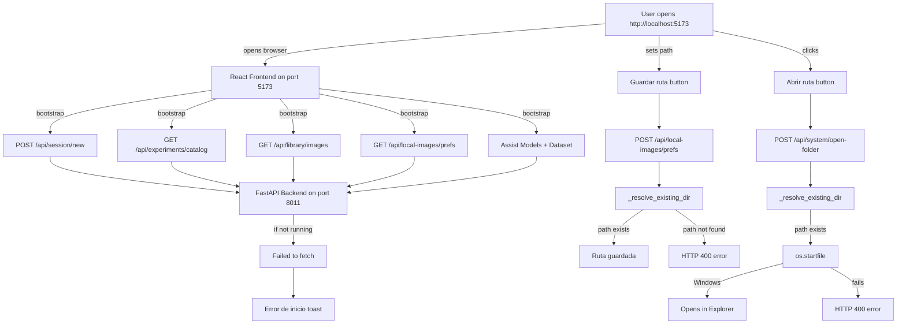

# Bug Fix Plan: "Error de inicio - Failed to fetch" & Path Setting Issues

## Root Cause Analysis

### Issue 1: "Error de inicio - Failed to fetch" on startup

**Root Cause**: The frontend's [`bootstrap()`](frontend/src/App.jsx:1704) function makes 5 sequential API calls during startup:
1. `POST /api/session/new` — create session
2. `GET /api/experiments/catalog` — list experiments
3. `GET /api/library/images` — refresh saved images
4. `GET /api/local-images/prefs` — refresh local image prefs
5. Additional calls for assist models and model dataset

If **any** of these calls fails (e.g., backend not running, backend on wrong port, CORS issue, or an exception in a backend endpoint), the entire `bootstrap()` catches the error and shows `toast('error', 'Error de inicio', errMsg(err))`.

The `errMsg()` function at [`App.jsx:7`](frontend/src/App.jsx:7) converts the error. If `fetch` itself fails (network error), the error is an `Event` (TypeError: Failed to fetch), and `errMsg` returns `'No se pudo renderizar la imagen en el navegador.'` — which is a **misleading message** for a network connectivity error.

**Most likely causes**:
1. **Backend server not running** — the user may not have started `run_local.bat`, or it failed silently
2. **Backend crashed on startup** — an import error or missing dependency in `backend/main.py` or its imports
3. **Port conflict** — another process on port 8011
4. **CORS issue** — though CORS middleware allows all origins, if the backend isn't running, CORS is irrelevant

### Issue 2: "Guardar Ruta" (save path) fails

**Root Cause**: The [`saveLocalImagePrefs()`](frontend/src/App.jsx:2427) function calls `POST /api/local-images/prefs` with `{ start_dir: path }`. The backend endpoint at [`main.py:642`](backend/main.py:642) calls `_resolve_existing_dir(req.start_dir)` at [`main.py:174`](backend/main.py:174).

The `_resolve_existing_dir` function:
```python
def _resolve_existing_dir(path_text: str) -> Path:
    raw = str(path_text or '').strip().strip('"')
    if not raw:
        raise HTTPException(status_code=400, detail='Ruta requerida.')
    path = Path(raw).expanduser()
    try:
        path = path.resolve()
    except Exception:
        path = path.absolute()
    if not path.exists() or not path.is_dir():
        raise HTTPException(status_code=400, detail=f'La ruta no existe o no es carpeta: {path}')
    return path
```

The path `C:\Users\alejo\Documents\GitHub\LOCO-detector\img` **does exist** (confirmed by the file listing). However, the frontend sends the path as a JSON string. The issue could be:
- **Backend not running** (same as Issue 1) — if the backend isn't running, ALL API calls fail with "Failed to fetch"
- The path validation in `_resolve_existing_dir` might fail if the path contains trailing spaces or special characters

### Issue 3: "Abrir ruta" (open folder) fails

**Root Cause**: The [`openFolder()`](frontend/src/App.jsx:2463) function calls `POST /api/system/open-folder` with `{ kind: 'custom', path: imageStartDir }`. The backend at [`main.py:693`](backend/main.py:693) calls `_resolve_existing_dir(req.path)` for `kind == 'custom'`, then tries `os.startfile(str(target))`.

If the path doesn't exist or isn't a directory, `_resolve_existing_dir` throws a 400 error. If `os.startfile` fails (e.g., no file explorer available, path too long), it throws a 400 error.

Again, if the **backend isn't running**, this also fails with "Failed to fetch".

## Diagnosis Steps

### Step 1: Verify backend is running
- Check if the backend process is active on port 8011
- Try `curl http://127.0.0.1:8011/api/health` or open in browser
- Check if `run_local.bat` was executed and both terminal windows are open

### Step 2: Check backend startup logs
- Look for any Python import errors or exceptions when starting the backend
- The backend runs via `uvicorn.run('backend.main:app', host='127.0.0.1', port=8011, reload=True)` in [`app.py`](app.py:7)
- Check if the virtual environment (`venv/`) exists and has all dependencies installed

### Step 3: Fix misleading error message
- The `errMsg()` function at [`App.jsx:7`](frontend/src/App.jsx:7) returns `'No se pudo renderizar la imagen en el navegador.'` for network errors (Event instances)
- This is misleading — it should say something like `'No se pudo conectar con el servidor. Verifica que el backend este ejecutandose en el puerto 8011.'`

### Step 4: Test the path endpoints directly
- Once backend is confirmed running, test `POST /api/local-images/prefs` with the path
- Test `POST /api/system/open-folder` with `kind: 'custom'` and the path
- Check if `C:\Users\alejo\Documents\GitHub\LOCO-detector\img` exists and is a directory

## Fix Plan

### Fix 1: Improve error message for network failures
**File**: [`frontend/src/App.jsx`](frontend/src/App.jsx:7-14)
**Change**: Update `errMsg()` to return a clearer message when `fetch` fails (TypeError/Event), indicating the backend may not be running.

### Fix 2: Add health check to bootstrap
**File**: [`frontend/src/App.jsx`](frontend/src/App.jsx:1704-1728)
**Change**: Before making the 5 sequential API calls, add a quick health check (`GET /api/health`) with a short timeout. If it fails, show a clear "Backend no disponible" error and stop.

### Fix 3: Make path validation more robust
**File**: [`backend/main.py`](backend/main.py:174-185)
**Change**: In `_resolve_existing_dir`, add better error messages and handle edge cases (trailing spaces, mixed slashes, etc.). Also consider allowing the path to be saved even if it doesn't exist yet (create it on demand).

### Fix 4: Add backend startup validation
**File**: [`run_local.bat`](run_local.bat)
**Change**: Add a health check loop after starting the backend to wait until it's actually ready before starting the frontend.

## Architecture Diagram



## Execution Order

1. **Fix the misleading error message** in `errMsg()` — this helps the user understand what's actually wrong
2. **Add health check to bootstrap** — prevents cascading failures and gives clear feedback
3. **Make path validation more robust** — handle edge cases in `_resolve_existing_dir`
4. **Add backend startup validation** to `run_local.bat` — ensures backend is ready before frontend starts
5. **Test end-to-end** — verify all fixes work together
