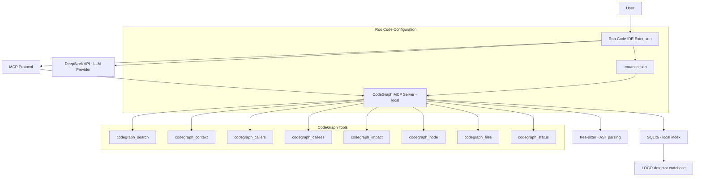

# Plan: Integrate CodeGraph MCP + DeepSeek with Roo Code

## Overview

Integrate [CodeGraph](https://github.com/colbymchenry/codegraph) as a local MCP server for Roo Code in the LOCO-detector project, and configure DeepSeek as the LLM provider. CodeGraph indexes the codebase using `tree-sitter` and SQLite, exposing tools like `codegraph_search`, `codegraph_context`, `codegraph_callers`, `codegraph_callees`, `codegraph_impact`, `codegraph_node`, `codegraph_files`, and `codegraph_status` — reducing token usage and unnecessary file reads.

## Architecture



## Prerequisites

- Node.js and npm installed on the system
- Roo Code extension installed in VS Code
- DeepSeek API key (user must provide)

## Step-by-Step Execution

### Step 1: Install CodeGraph globally

Run in PowerShell (as Administrator):

```powershell
npm install -g @colbymchenry/codegraph
```

Verify installation:

```powershell
codegraph --help
```

### Step 2: Initialize CodeGraph in the project

Navigate to the project root and initialize:

```powershell
cd "C:\Users\alejo\Documents\GitHub\LOCO-detector"
codegraph init -i
```

This creates the `.codegraph/` directory with the indexed graph (SQLite + tree-sitter data).

Verify the index:

```powershell
codegraph status
```

### Step 3: Create `.roo/mcp.json` configuration

Create the directory and file:

- **Path:** `.roo/mcp.json`
- **Content:** MCP server configuration pointing to CodeGraph

Two variants provided:
1. **Direct command** (preferred): uses `codegraph serve --mcp` directly
2. **cmd.exe wrapper** (fallback for Windows): uses `cmd /c codegraph serve --mcp`

All 8 CodeGraph tools are listed in `alwaysAllow` so Roo can call them without prompting.

### Step 4: Update `.gitignore`

Add the following entries to `.gitignore`:

```
# CodeGraph index
.codegraph/
```

This prevents the local index from being committed to version control.

### Step 5: Configure DeepSeek in Roo Code

In VS Code → Roo Code settings:

| Setting | Value |
|---------|-------|
| API Provider | DeepSeek |
| API Key | (user's DeepSeek API key) |
| Model (coding) | `deepseek-v4-pro` or `deepseek-reasoner` |
| Model (quick/cheap) | `deepseek-v4-flash` or `deepseek-chat` |

**Note:** `deepseek-chat` and `deepseek-reasoner` are scheduled for deprecation on July 24, 2026. Prefer `deepseek-v4-pro` and `deepseek-v4-flash` for future-proofing.

### Step 6: Verify integration

1. Restart VS Code or reload the window (`Developer: Reload Window`)
2. Open Roo Code → MCP panel → confirm CodeGraph shows as connected
3. Test with a prompt like:

```
Usa CodeGraph para mapear la arquitectura del proyecto LOCO-detector.
Primero revisa el estado del índice con codegraph_status.
Luego usa codegraph_search, codegraph_context, codegraph_callers,
codegraph_callees o codegraph_impact según corresponda.
No modifiques nada todavía. Entrégame primero un resumen estructural.
```

## Files to Create/Modify

| File | Action | Description |
|------|--------|-------------|
| `.roo/mcp.json` | **Create** | MCP server config for CodeGraph |
| `.gitignore` | **Modify** | Add `.codegraph/` exclusion |

## Files NOT to Modify

- No source code files (`.py`, `.jsx`, `.ts`, etc.) need changes
- No configuration files beyond `.roo/mcp.json` and `.gitignore`

## Rollback Plan

If something goes wrong:

1. Delete `.roo/mcp.json` to disconnect CodeGraph from Roo
2. Delete `.codegraph/` directory to remove the local index
3. Uninstall CodeGraph: `npm uninstall -g @colbymchenry/codegraph`
4. Revert `.gitignore` changes
