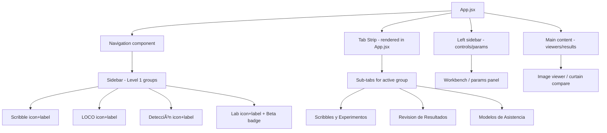

# GUI Navigation Redesign Plan

## Current State

The navigation currently renders as a horizontal bar above the main layout:

```
┌─────────────────────────────────────────────────────┐
│ ✏️ Grupo 1: Entrenamiento Scribble  │ 🔵 Grupo 2: ... │ 📏 Grupo 3: ... │ ── │ 🧪 Laboratorio LOCO [Experimental] │
│   Scribbles y Experimentos  │  Revision de Resultados  │  Modelos de Asistencia  │
└─────────────────────────────────────────────────────┘
│  ┌── left sidebar ──┐  │  ┌── main content ──┐  │
```

**Problems:**
- Group labels are very long ("Grupo 1: Entrenamiento Scribble") taking lots of horizontal space
- All 3 groups + LOCO Lab are shown simultaneously, creating visual noise
- Sub-tabs appear below groups as a second row, adding another layer
- The nav bar pushes the main content down

## Proposed Design (from recommendation)

Collapsible sidebar (Level 1) + horizontal tab strip above content (Level 2):

```
┌───┐ ┌───────────────────────────────────────────────────┐
│ ✏️ │ │  Scribbles y Experimentos  │  Revision de ...    │  ← tab strip
│    │ │───────────────────────────────────────────────────│
│ 🔵 │ │                                                   │
│    │ │              Main content area                    │
│ 📏 │ │                                                   │
│    │ │                                                   │
│ 🧪 │ │                                                   │
│ ⚙️ │ │                                                   │
└───┘ └───────────────────────────────────────────────────┘
  ↑                          ↑
sidebar (50px)           content area
collapsed                 with tab strip
```

When expanded (~200px):

```
┌──────────┐ ┌────────────────────────────────────────────┐
│ ✏️ Scribble│ │  Scribbles y Experimentos  │  Revision ... │
│──────────│ │────────────────────────────────────────────│
│ 🔵 LOCO   │ │                                            │
│──────────│ │              Main content                   │
│ 📏 Detecc.│ │                                            │
│──────────│ │                                            │
│ 🧪 Lab 🅱️ │ │                                            │
│──────────│ │                                            │
└──────────┘ └────────────────────────────────────────────┘
```

## Changes Required

### 1. [`frontend/src/components/Navigation.jsx`](frontend/src/components/Navigation.jsx)

**Rename groups** to short names:
| Current | New |
|---------|-----|
| `Grupo 1: Entrenamiento Scribble` | `Scribble` |
| `Grupo 2: Entrenamiento LOCO` | `LOCO` |
| `Grupo 3: Deteccion y Medicion` | `Detección` |
| `Laboratorio LOCO` | `Lab` |

**Restructure rendering:**
- Remove the horizontal `.nav-groups` bar and `.nav-subtabs` row
- Replace with a single `<aside>` sidebar element that:
  - Starts collapsed at `50px` width, showing only icons
  - Expands to `200px` on hover or toggle button click, showing icon + short label
  - Has a separator line between "Entrenamiento" group (Scribble + LOCO) and "Producción" (Detección)
  - Has another separator before "Lab" with a "Beta" badge
- Add a horizontal tab strip rendered ABOVE the main content area (not inside Navigation)

**Props changes:**
- Add `collapsed` boolean prop (or manage internally via state)
- Add `onToggleCollapse` callback

### 2. [`frontend/src/App.jsx`](frontend/src/App.jsx)

**Layout restructure:**
- Current: `<Navigation />` → `<div className="layout"><aside className="left">...<section className="main">...`
- New: `<div className="app-layout"><aside className="sidebar">...<div className="content-area"><div className="tab-strip">...<div className="layout">...`

**Move tab strip to content area:**
- The Level 2 sub-tabs (Scribbles y Experimentos, Revision de Resultados, etc.) should render as a horizontal tab strip above the main content, not inside the Navigation component
- This tab strip only shows tabs for the currently active group

**Add sidebar collapse state:**
- New state: `sidebarCollapsed` (boolean, default `true`)
- Pass to Navigation component
- Toggle via button click or hover

### 3. [`frontend/src/styles.css`](frontend/src/styles.css)

**New CSS classes needed:**
- `.app-layout` — flex container for sidebar + content area
- `.sidebar` — the collapsible sidebar (width transitions between 50px and 200px)
- `.sidebar.collapsed` — 50px wide, only icons visible
- `.sidebar.expanded` — 200px wide, icons + labels visible
- `.sidebar-group-btn` — each group button in the sidebar
- `.sidebar-separator` — visual separator between training/production/lab sections
- `.sidebar-badge` — "Beta" badge for Lab
- `.tab-strip` — horizontal bar above main content
- `.tab-strip-btn` — individual tab buttons

**Remove (or keep for backward compat):**
- `.nav-container`, `.nav-groups`, `.nav-subtabs`, `.nav-group-btn`, `.nav-subtab-btn`, `.nav-separator`, `.nav-badge` — can be removed if Navigation is fully rewritten

### 4. [`frontend/src/components/Navigation.jsx`](frontend/src/components/Navigation.jsx) — Detailed rewrite

```jsx
const SIDEBAR_ITEMS = [
  { type: 'section', label: 'Entrenamiento' },
  { type: 'group', key: 'scribble', label: 'Scribble', icon: '✏️' },
  { type: 'group', key: 'loco', label: 'LOCO', icon: '🔵' },
  { type: 'separator' },
  { type: 'section', label: 'Producción' },
  { type: 'group', key: 'detection', label: 'Detección', icon: '📏' },
  { type: 'separator' },
  { type: 'group', key: 'locoLab', label: 'Lab', icon: '🧪', badge: 'Beta' },
]
```

The component renders the sidebar with these items. The tab strip (Level 2) is rendered separately by App.jsx using the `GROUPS` data.

## Implementation Steps

1. **Rewrite [`Navigation.jsx`](frontend/src/components/Navigation.jsx)**:
   - Change from horizontal bar to vertical sidebar
   - Add collapsed/expanded states
   - Rename group labels to short names
   - Add section separators (Entrenamiento / Producción)
   - Add Beta badge for Lab
   - Export `GROUPS` constant (already exported implicitly) for App.jsx to use for tab strip

2. **Update [`App.jsx`](frontend/src/App.jsx)**:
   - Add `sidebarCollapsed` state
   - Restructure layout: sidebar on left, content area on right
   - Add tab strip rendering above main content
   - The tab strip shows sub-tabs for the active group

3. **Update [`styles.css`](frontend/src/styles.css)**:
   - Add all new sidebar and tab strip CSS
   - Remove old nav CSS classes
   - Ensure responsive behavior (sidebar collapses fully on small screens)

## Mermaid Diagram



## Risks and Considerations

- **Backward compatibility**: The `legacyToGroup()` and `groupToLegacy()` functions should remain unchanged since they just map string keys
- **workspaceTab state**: Still used extensively in `useEffect` hooks for keyboard shortcuts and data loading — must keep it in sync
- **Responsive**: On screens < 1250px, the sidebar should collapse fully (0px width) and show a hamburger menu instead
- **Tab strip position**: Must be above the `.layout` grid but below the sidebar header — careful with CSS grid/flex nesting
- **No icon on sub-tabs**: The recommendation explicitly says sub-tabs should be text-only (no icons) to avoid visual noise
