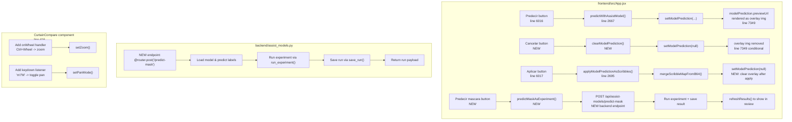

# Plan: Model Prediction Improvements & Curtain Comparator Enhancements

## Overview

Three related improvements to the assist model prediction flow and the result review curtain comparators:

1. **Fix overlay persistence** — When "Aplicar" is clicked, the model preview overlay should be removed from the editor view
2. **Add "Cancelar" button** — Between "Predecir" and "Aplicar", to clear the prediction overlay without applying it
3. **Add "Predecir mascara" button** — Runs the model prediction as a full experiment (segmentation pipeline), saving the result directly into the review system
4. **Curtain comparator keyboard/mouse enhancements** — In both "Original vs Overlay" and "Original vs Mascara" curtain comparators: pressing `M` toggles pan mode, `Ctrl+Wheel` zooms in/out

---

## Architecture



---

## Detailed Steps

### Step 1: Clear overlay after "Aplicar" + Add "Cancelar" button

**Files:** `frontend/src/App.jsx`

**1a. Modify `applyModelPredictionAsScribbles()`** (line 2695)
- After successful application, add `setModelPrediction(null)` to clear the overlay from the editor view

**1b. Add `clearModelPrediction()` function** (after line 2710)
```javascript
function clearModelPrediction() {
  setModelPrediction(null)
}
```

**1c. Add "Cancelar" button** (between Predecir and Aplicar, line 6017)
```jsx
<button onClick={clearModelPrediction} disabled={!modelPrediction}>Cancelar</button>
```

**Result:** After clicking "Aplicar", the overlay disappears. "Cancelar" also clears it without applying.

---

### Step 2: Add "Predecir mascara" backend endpoint

**Files:** `backend/assist_models.py`, `backend/main.py`

**2a. Create `PredictMaskReq` model** in `backend/assist_models.py`
```python
class PredictMaskReq(BaseModel):
    session_id: str = ''
    image_id: str = ''
    model_id: str = ''
    min_confidence: float = 0.72
    include_fiber: bool = True
    include_halo: bool = True
    include_background: bool = True
    experiment_id: str = 'assist_model_mask'
    save_mode: str = 'append'
```

**2b. Create `predict_mask()` endpoint** in `backend/assist_models.py`
- Load model and predict labels (same logic as existing `predict_model`)
- Build a `RunReq`-like payload with the predicted labels as scribble_map_b64
- Call `run_experiment()` from `backend/runner.py` with a dedicated experiment_id
- Save the run via `save_run()` from `backend/persistence.py`
- Return the run payload (overlay_b64, mask_b64, etc.)

**Key design decision:** The predicted mask from the assist model is converted into a scribble map (labels_to_visual format), then passed through the standard experiment pipeline. This way it generates proper overlay + mask outputs compatible with the review system.

**2c. Register the new router endpoint** in `backend/main.py`
- Import the new function or add the route directly

**Alternative approach (simpler):** Instead of running through the full experiment pipeline, we can:
1. Generate the suggestion mask from the model
2. Create a minimal `RunArtifacts` directly with the suggestion as both mask and overlay
3. Save it via `save_run()`
4. Return the payload

This is simpler and avoids requiring a specific experiment_id. The mask IS the prediction.

**Chosen approach:** Create a minimal run artifact directly:
```python
@router.post('/predict-mask')
def predict_mask(req: PredictMaskReq) -> dict[str, Any]:
    sess = _require_session(req.session_id)
    # ... same prediction logic as predict_model ...
    # Build a minimal RunArtifacts-like payload
    suggestion_u8 = suggestion  # uint8 labels
    overlay = apply_mask_overlay(rgb, (suggestion_u8 > 0).astype(np.uint8), ...)
    # Save as a run
    art = RunArtifacts(
        run_id=new_run_id('assist_model_mask'),
        image_id=image_id,
        experiment_id='assist_model_mask',
        created_at=now_str(),
        input_image=rgb,
        scribble_labels=np.zeros_like(suggestion_u8),
        prior_map=np.zeros_like(suggestion_u8, dtype=np.float32),
        mask=(suggestion_u8 > 0).astype(np.uint8),
        overlay=overlay,
        meta={...},
    )
    save_meta = save_run(art)
    run_item = load_run(art.run_id)
    payload = _run_to_payload(run_item)
    return {'ok': True, 'payload': payload}
```

---

### Step 3: Add "Predecir mascara" frontend button

**Files:** `frontend/src/App.jsx`

**3a. Add `predictMaskAsExperiment()` function** (after `predictWithAssistModel()`)
```javascript
async function predictMaskAsExperiment() {
    const sid = await ensureSessionReady()
    if (!sid || !imageId) return
    const mid = String(selectedAssistModelId || defaultAssistModelId || '').trim()
    if (!mid) {
      toast('warning', 'Modelo guardado', 'Entrena o selecciona un modelo primero.')
      return
    }
    await withLoad('modelsPredict', async () => {
      const res = await apiPost('/api/assist-models/predict-mask', {
        session_id: sid,
        image_id: imageId,
        model_id: mid,
        min_confidence: Number(modelMinConfidence || 0.72),
        include_fiber: !!modelIncludeFiber,
        include_halo: !!modelIncludeHalo,
        include_background: !!modelIncludeBackground,
      })
      // Switch to review tab and load the result
      setWorkspaceTab('review')
      await refreshResults(imageId)
      toast('success', 'Mascara generada', 'Resultado disponible en Revision de resultados.')
    })
}
```

**3b. Add the button** below the existing 3 buttons (after line 6017)
```jsx
<button className="primary" onClick={predictMaskAsExperiment} disabled={!imageUrl || !selectedAssistModelId || loading.modelsPredict}>
  Predecir mascara
</button>
```

---

### Step 4: Curtain comparator keyboard/mouse enhancements

**Files:** `frontend/src/App.jsx` (CurtainCompare component, lines 416-532)

**4a. Add `onWheel` handler** to the curtain stage div (line 507)
```jsx
onWheel={onCurtainWheel}
```

**4b. Add `onCurtainWheel` function** inside CurtainCompare
```javascript
function onCurtainWheel(e) {
  if (!maskUrl) return
  if (e.ctrlKey || e.metaKey) {
    e.preventDefault()
    const factor = e.deltaY < 0 ? 1.2 : 0.84
    setZoom((z) => clamp(z * factor, 0.25, 8))
  }
}
```

**4c. Add `useEffect` for keyboard listener** inside CurtainCompare
```javascript
useEffect(() => {
  const onKey = (ev) => {
    const k = String(ev.key || '').toLowerCase()
    if (k === 'm') {
      // Only toggle if this curtain panel is visible/active
      // We use a data attribute or check if the stage is mounted
      setPanMode((v) => !v)
    }
  }
  window.addEventListener('keydown', onKey)
  return () => window.removeEventListener('keydown', onKey)
}, [])
```

**Important consideration:** Since there are TWO CurtainCompare instances on the page, pressing `M` should toggle pan mode on BOTH. This is actually the desired behavior since both comparators share the same viewport context.

**4d. Update the "Mano" button** to reflect the `panMode` state visually (already done via `toggle-active` class, line 499).

---

### Step 5: Verify and test

1. Run `python -m pytest tests/ -v --tb=short` to confirm no regressions
2. Manual verification:
   - Click "Predecir" → overlay appears on editor
   - Click "Cancelar" → overlay disappears
   - Click "Predecir" → overlay appears → Click "Aplicar" → scribbles applied + overlay disappears
   - Click "Predecir mascara" → result appears in "Revisión de resultados" tab
   - In curtain comparators: press `M` → cursor changes to grab → drag to pan
   - `Ctrl+Wheel` → zoom in/out on curtain comparators

---

## Files to Modify

| File | Changes |
|------|---------|
| `frontend/src/App.jsx` | Modify `applyModelPredictionAsScribbles()` to clear overlay; add `clearModelPrediction()`; add "Cancelar" button; add "Predecir mascara" button + handler; add `onCurtainWheel` + keyboard listener in `CurtainCompare` |
| `backend/assist_models.py` | Add `PredictMaskReq` model; add `predict_mask()` endpoint that generates mask + saves as run |
| `backend/main.py` | No changes needed if endpoint is on the assist_models router |

---

## Risks & Mitigations

| Risk | Mitigation |
|------|------------|
| The `predict_mask` endpoint creates runs with `experiment_id='assist_model_mask'` which may not match any registered experiment | Use a generic experiment_id; the review system doesn't require it to be in the registry |
| Two CurtainCompare instances both listen for `M` key → double toggle | Only one `useEffect` per component; each toggles its own `panMode` state independently, which is fine |
| `Ctrl+Wheel` may conflict with browser zoom | `e.preventDefault()` in the handler prevents browser default |
